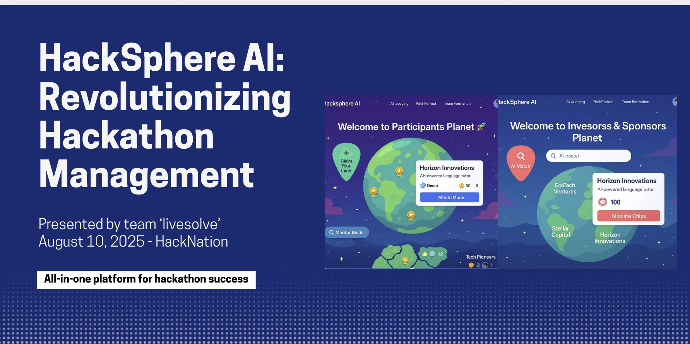
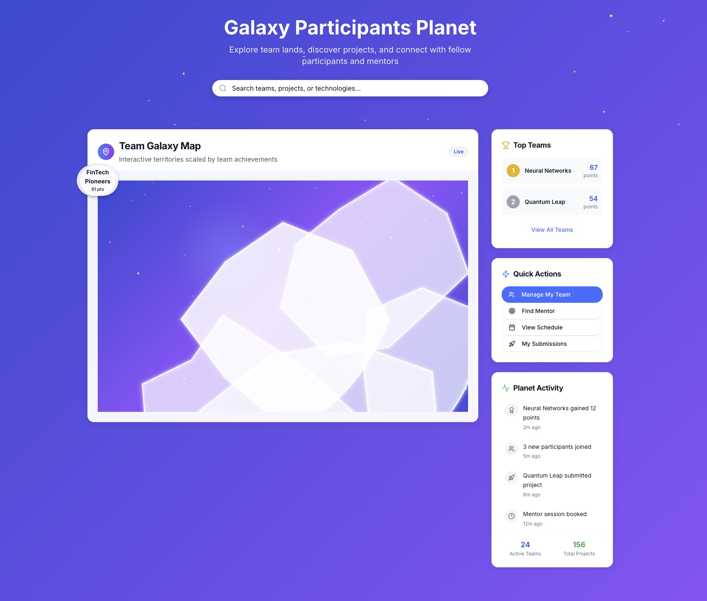
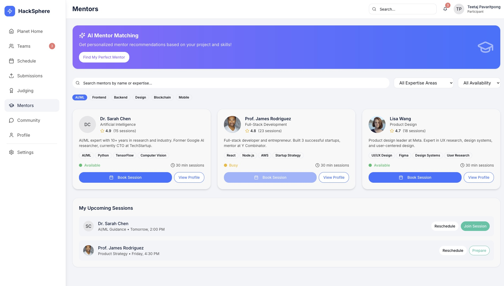

# HackSphere AI - Monorepo

This repository is structured as a monorepo using **Moon** and **Bun** to streamline development across multiple projects. Below are guidelines to help you navigate and work effectively within this setup.

## Folder Structure Overview

### Applications (`/apps/`)
- **/apps/web/**  
  Next.js web application (frontend) with App Router, TypeScript, and Tailwind CSS.

- **/apps/api/**  
  Core API service built with Fastify, Drizzle ORM, and PostgreSQL. Contains all business domain modules.

- **/apps/ai-orchestrator/**  
  Python-based AI agent orchestration service using FastAPI, LangChain, and CrewAI.

- **/apps/workers/**  
  Background workers and notifications service for handling async jobs and integrations.

### Shared Packages (`/packages/`)
- **/packages/ui/**  
  Shared UI component library with Storybook for design system consistency.

- **/packages/database/**  
  Database models, repositories, and migrations using Drizzle ORM with PostgreSQL.

- **/packages/auth/**  
  Authentication and authorization utilities with JWT and RBAC support.

- **/packages/events/**  
  Event-driven architecture utilities for publishers, subscribers, and event types.

- **/packages/integrations/**  
  External API integrations (Slack, Discord, GitHub, Calendar, Canva, Apify).

- **/packages/config/**  
  Configuration management with environment validation.

### Shared Libraries (`/shared/`)
- Type definitions, utilities, constants, and validation schemas used across all applications.

### Supporting Directories
- **/docs/**  
  Project documentation including architecture, API docs, and deployment guides.

- **/infrastructure/**  
  Infrastructure as Code (Docker, Kubernetes, Terraform) for deployment.

- **/scripts/**  
  Build, deployment, and migration scripts.

- **/tools/legacy/**  
  Migrated legacy utilities (now integrated into AI orchestrator agents).

## Development Guidelines

1. **Consistency & Structure**  
   - Adhere to the existing folder conventions when adding new modules or features.
   - Ensure that all new code follows the repository’s style and naming conventions.

2. **Modular Development**  
   - Develop new features within their respective directories.
   - When functionality is shared between apps, consider placing it in the appropriate package to promote reuse.

3. **Dependency Management**  
   - Uses **Bun workspaces** for package management and **Moon** for task orchestration.
   - Keep dependencies synchronized to avoid version conflicts.
   - Install dependencies: `bun install`

4. **Building & Testing**  
   - Use Moon commands for building and testing: `moon run :build`, `moon run :test`
   - Each application and package has its own build and test scripts.
   - Run specific project tasks: `moon run web:dev`, `moon run api:build`

5. **CI/CD Integration**  
   - Configure CI pipelines to target only the changed areas of the repository.
   - Prioritize modular testing and incremental builds to improve efficiency.

6. **Documentation & Maintenance**  
   - Update relevant sections of the README or dedicated documentation when adding new features or restructuring code.
   - Follow commit message conventions and contribution guidelines to keep project history clear and informative.

By adhering to these guidelines, you ensure that each component remains modular, maintainable, and scalable within the monorepo structure.

## Quick Start

### Prerequisites
- **Bun**: Package manager and JavaScript runtime
- **Moon**: Monorepo task runner
- **Docker**: For local development services

### Setup
1. **Install dependencies**
   ```bash
   bun install
   ```

2. **Start local services**
   ```bash
   docker-compose up -d
   ```

3. **Initialize Moon workspace**
   ```bash
   moon setup
   ```

4. **Run development servers**
   ```bash
   # All apps in development mode
   moon run :dev

   # Individual apps
   moon run web:dev      # Frontend at http://localhost:3000
   moon run api:dev      # API at http://localhost:8000
   moon run workers:dev  # Background workers
   ```

### Available Commands
- `moon run :build` - Build all projects
- `moon run :test` - Run all tests
- `moon run :lint` - Lint all projects
- `moon check --all` - Check project dependencies and configuration
- `moon clean` - Clean all build artifacts

### Environment Variables
Copy `.env.example` to `.env` and configure the required environment variables for local development.

